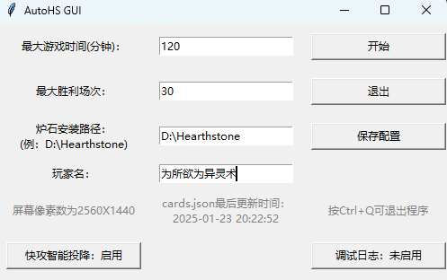
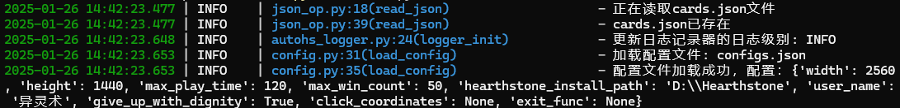

# AutoHS

**目前已经恢复了对狂野模式暗牧的支持，不过整体胜率并不是很乐观，只能说未来可期。不过可以用来刷经验。**

## 主要新特性
- 已支持回归后的新版炉石。鉴于经典模式被删除，目前已面向狂野模式进行开发，并新增了对地标等新卡的识别
- 支持2560x1440分辨率
- 全新的日志模块，看着像模像样
- GUI启动与配置界面
- 基于SIMM相似度的游戏状态识别，相比于像素点判断更加稳定

<!-- 原来的脚本是通过计算机视觉手段（分析图片哈希相似度等）来分析局势的，但现在这个方案已经被放弃了（非常不靠谱）。可以在`cv`分支中看到cv相关的代码。 -->

### 如何运行

0. 安装`Python3`。

1. 安装所需依赖:
```
pip install -r requirements.txt
```

2. 启动命令行并在项目目录下运行`python main.py`。运行正常的话应该能看到如下图所示的GUI界面：

同时命令行中会开始打印日志信息如下：


3. 更新脚本配置，必须更新GUI界面中的`炉石安装路径`和`玩家名`两项配置。脚本需要使用前者来定位炉石传说游戏的`Power.log`位置，使用后者来在对局中识别哪一方是玩家。玩家名的格式为`为所欲为、异灵术#54321`，不过可以只输入部分名字，脚本会进行字符串匹配。

<!-- 2. 在`constants/constants`里有一些参数可以设置，其中有两项必须修改：
   - 名为`YOUR_NAME`的变量需要改成你的炉石用户名，形如`为所欲为、异灵术#54321`。如果不在文件里修改，每次启动脚本时系统都会提示你手动输入用户名。
   - 名为`HEARTHSTONE_POWER_LOG_PATH`的变量必须修改成你的电脑上的炉石传说日志`Power.log`的路径，`Power.log`在炉石安装路径下的`Logs/`文件夹中。 -->

> `Power.log`中记录了对战过程中每一个**对象**(**Entity**)的每一项**属性**(**tag**)的变化。 这个**对象**包括玩家、英雄、英雄技能、卡牌(无论在牌库里、手牌中、战场上还是坟地里)等。
> 
> 每次启动炉石传说时，游戏会在`Logs/`目录下新创建一个文件夹，文件夹内包含`Power.log`以及其他文件。
> 
> 如果你在`Logs/`目录下没有找到`Power.log`（指对战开始后），那稍微有一些麻烦。你需要到`C:\Users\YOURUSER\AppData\Local\Blizzard\Hearthstone`目录下新建一个叫`log.config`的文件（如果已经有就不用新建了），然后把下面这段代码放进去（如果已经有`[Power]`相关则更改相关设置）:
> ```
> [Power]
> LogLevel=1
> FilePrinting=True
> ConsolePrinting=False
> ScreenPrinting=False
> Verbose=True
> [Log]
> FileSizeLimit.Int=-1
> ```
> 
> 关于炉石log的更多信息可以查看这个
> [Reddit帖子](https://www.reddit.com/r/hearthstone/comments/268fkk/simple_hearthstone_logging_see_your_complete_play/) 。

3. 可以先跑一跑`demo/`下的一些文件。

4. 若要启动脚本，将当前目录切换到`AutoHS/`下（重要），运行`python main.py`即可。注意以下几点：
   - **显示分辨率**（在桌面右击的显示设置里调整）以及**炉石分辨率**为**1920x1080**或**2560x1440**。
   - 炉石**全屏**且语言为**简体中文**、**繁体中文**或**英文**。
   - 启动战网或是炉石。
   - 你可以把战网客户端最小化到任务栏，或是放在炉石应用下面，但请不要关闭战网客户端。有时炉石会意外关闭，这时程序会试图通过战网客户端重新打开炉石。
   - 在启动脚本前要保证进入对战模式后的默认卡组是脚本应该使用的卡组，而且模式是期望的模式


### 我目前用的挂机卡组 
狂野模式：暗牧
职业：牧师
模式：狂野模式
2x (0) 亡者复生
2x (1) 宝藏经销商
2x (1) 心灵按摩师
2x (1) 暗影投弹手
1x (1) 海盗帕奇斯
2x (1) 精神灼烧
2x (1) 虚触侍从
2x (1) 针灸
2x (1) 错误产物
2x (1) 随船外科医师
2x (2) 心灵震爆
2x (2) 空降歹徒
2x (2) 纸艺天使
2x (2) 迪菲亚麻风侏儒
2x (4) 狂暴邪翼蝠
1x (5) 黑暗主教本尼迪塔斯

AAEBAZ/HAgKRvAK79wMOoQSRD+mwA7q2A9fOA633A42BBN2kBZWqBcSoBvyoBte6BtXBBtzzBgAA


### 如果想加入新的卡牌
对于所有的**非战吼随从**，如果没有具体实现它，脚本会根据它的费用猜测它的价值（费用越高越厉害）。而脚本不会使用未识别的战吼随从、法术、武器。如果想要让脚本识别并合理运用一张卡牌，你需要干两件事：
1. 在`card/detail_card.py`中写下它的使用规则，比如使用它的期望值、使用它时鼠标要点哪里等。
2. 在`card/id2card.py`中加入一个它的**id**与其卡牌实现类的键值对。

> 关于**id**，在炉石中每一个**Entity**都有其对应的**id**，比如各种各样的吉安娜有各种各样的**id**：
> - HERO_08 吉安娜·普罗德摩尔
> - HERO_08c 火法师吉安娜
> - HERO_08f 学生吉安娜
> - HERO_08g 奥术师吉安娜
> - HERO_08h 学徒吉安娜
> - HERO_08i 大法师吉安娜
> - HERO_08j 库尔提拉斯的吉安娜
> - HERO_08k 灵风吉安娜
> 
> 英雄技能各有**id**，一个同样的技能会有好多**id**，并随着皮肤的切换改变**id**：
> - HERO_07bp 生命分流
> - HERO_07dbp 生命分流
> - HERO_07ebp 生命分流
> - VAN_HERO_07bp 生命分流
> - CS2_056_H1 生命分流
> - CS2_056_H2 生命分流
> - CS2_056_H3 生命分流
> - HERO_07bp2 灵魂分流（生命分流的升级技能）
> 
> 卡牌，连带着它的衍生牌、增益效果、抉择选项，各有各的**id**：
> - SW_091 恶魔之种
> - SW_091t 建立连接
> - SW_091t3 完成仪式
> - SW_091t4 枯萎化身塔姆辛
> - SW_091t5 枯萎化身
> 
> 如果想获取卡牌的**id**，可以直接运行`json_op.py`，它会在脚本根目录下生成一个名为`id-name.txt`的文件，包含了炉石中每一个对象的**id**与中文名的对应关系。

### Demo文件说明
- `demo/catch_screen_demo.py`: 运行此文件会获取炉石传说进程的整个截屏(无论是在前台还是后台)，并画上一些坐标基准线，方便判断想实现的操作的坐标值。
- `demo/game_state_snapshot_demo.py`: 在控制台显示目前的炉石战局情况，包括显示手牌情况，英雄情况，随从情况等； 还会在`demo/`目录下创建一个名为`game_state_sanpshot.txt`的文件，记录log分析情况。 需要在`Power.log`存在，即进入对战模式后调用。（甚至可以在选起手手牌时使用）
- `demo/get_window_name.py`: 显示当前所有窗口的名称和编号，可以用来看炉石传说叫什么名字……
- `demo/mouse_control_demo.py`: 一个样例程序，展示了如何控制鼠标。
<!-- - `click.py`: 包含了与鼠标控制相关的代码。
- `FSM_action.py`: 包含了脚本在炉石运行中的不同状态（比如选英雄界面、对战时、对扎结束后）应该采取什么行为以及何时进入下一站状态的代码。
- `lop_op.py`: 包含了与读取`Power.log`相关的代码，比如针对不同日志行的正则表达式。
- `json_op.py`: 包含了从网络上下载炉石数据JSON文件，并将其初步处理的代码。直接运行可以生成`id-name.txt`，一个包含了炉石所有对象**id**与中文名对应关系的文件。  
- `log_state.py`: 读取`log.py`提取的日志信息，并把他们转化成字典的列表的形式。每一个字典是一个 **Entity**，**Entity** 由不同的 **tag** 及其对应值构成。
- `strategy.py`: 读取`log_state.py`提取的信息，并从中提取出手牌信息，战场信息，墓地信息等，再根据这些具体信息思考行动策略。
- `card/`: 用于存放针对某些特殊卡牌的具体逻辑。 -->